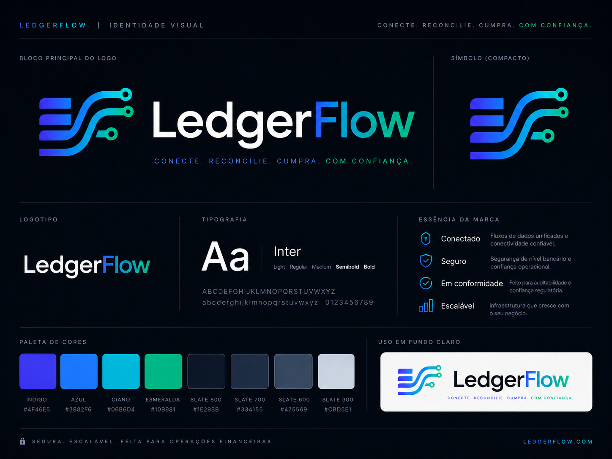
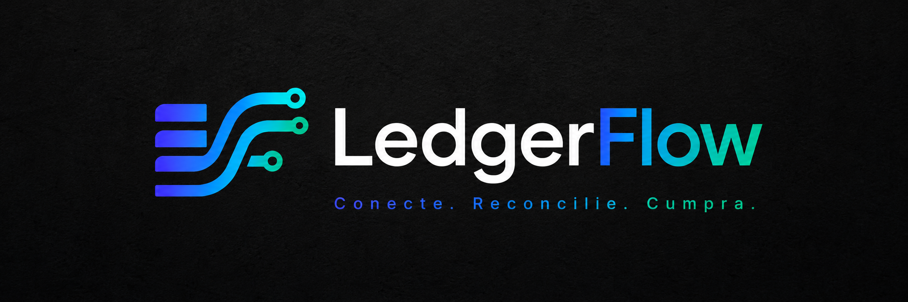
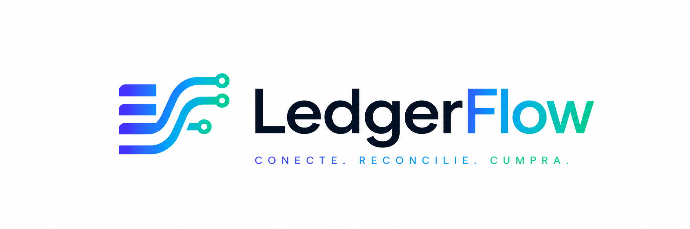
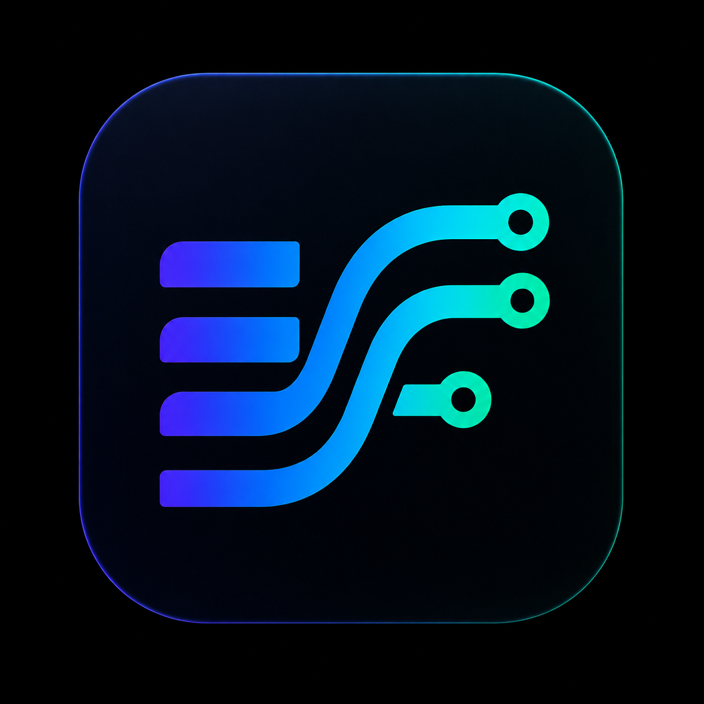

# LedgerFlow Brand Identity

LedgerFlow uses a dark enterprise fintech identity focused on trust, security, auditability and operational clarity.

## Visual Assets

## Paleta oficial

* Indigo: #4F46E5
* Blue: #3B82F6
* Cyan: #06B6D4
* Emerald: #10B981
* Background Primary: #09090B
* Background Secondary: #0F172A
* Surface: #18181B
* Slate 800: #1E293B
* Slate 700: #334155
* Slate 300: #CBD5E1
* Text Primary: #F8FAFC

## Tipografia

* Inter ou system-ui

## Regras

* Não distorcer o logo.
* Não aplicar sombras fortes adicionais.
* Não usar sobre fundos com baixo contraste.
* Usar logo dark em superfícies escuras.
* Usar logo light em superfícies claras.
* Usar app icon para favicon, loading e estados compactos.
* Não recriar o logo em texto puro quando a imagem oficial estiver disponível (exceto na composição `BrandMark` que utiliza ícone + texto).
* Para painéis e áreas "Hero", utilizar imagens de fundo puramente decorativas, renderizando tipografia e componentes (títulos, ícones e subtítulos) sempre via código (Vue/HTML + i18n), evitando textos embutidos nas imagens.
