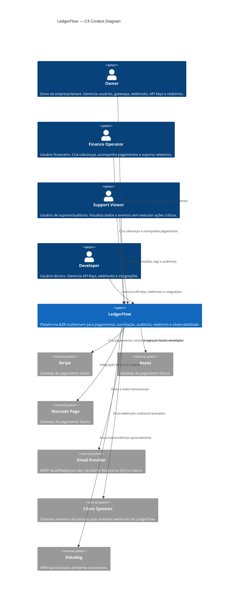

```mermaid
C4Context
    title LedgerFlow — C4 Context Diagram

    Person(owner, "Owner", "Dono da empresa/tenant. Gerencia usuários, gateways, webhooks, API Keys e relatórios.")
    Person(finance, "Finance Operator", "Usuário financeiro. Cria cobranças, acompanha pagamentos e exporta relatórios.")
    Person(support, "Support Viewer", "Usuário de suporte/auditoria. Visualiza dados e eventos sem executar ações críticas.")
    Person(developer, "Developer", "Usuário técnico. Gerencia API Keys, webhooks e integrações.")

    System(ledgerflow, "LedgerFlow", "Plataforma B2B multitenant para pagamentos, conciliação, auditoria, relatórios e observabilidade.")

    System_Ext(stripe, "Stripe", "Gateway de pagamento inicial.")
    System_Ext(asaas, "Asaas", "Gateway de pagamento futuro.")
    System_Ext(mercadopago, "Mercado Pago", "Gateway de pagamento futuro.")
    System_Ext(emailProvider, "Email Provider", "SMTP local/Mailpit em dev; SendGrid, Resend ou SES no futuro.")
    System_Ext(clientSystems, "Client Systems", "Sistemas externos dos tenants que recebem webhooks do LedgerFlow.")
    System_Ext(datadog, "Datadog", "APM opcional para ambiente corporativo.")

    Rel(owner, ledgerflow, "Gerencia tenant, usuários, gateways e relatórios")
    Rel(finance, ledgerflow, "Cria cobranças e acompanha pagamentos")
    Rel(support, ledgerflow, "Consulta transações, logs e auditorias")
    Rel(developer, ledgerflow, "Gerencia API Keys, webhooks e integrações")

    Rel(ledgerflow, stripe, "Cria pagamentos, consulta status e recebe webhooks")
    Rel(ledgerflow, asaas, "Integração futura via adapter")
    Rel(ledgerflow, mercadopago, "Integração futura via adapter")
    Rel(ledgerflow, emailProvider, "Envia e-mails transacionais")
    Rel(ledgerflow, clientSystems, "Envia webhooks outbound assinados")
    Rel(ledgerflow, datadog, "Envia traces/métricas opcionalmente")
```
