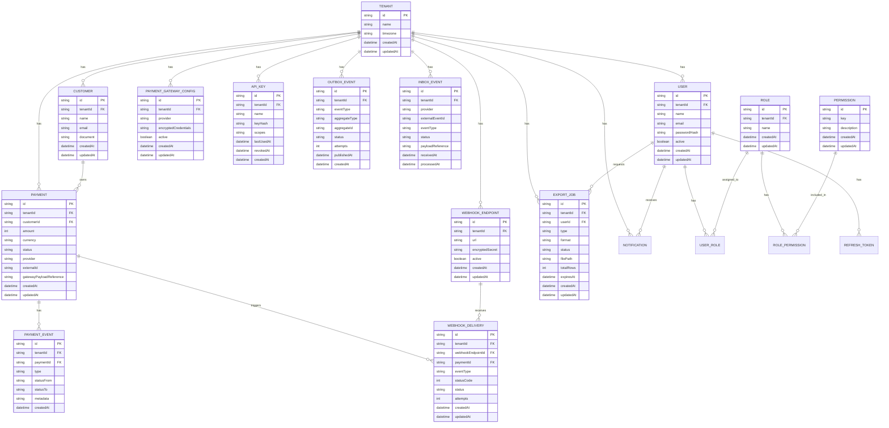

```mermaid
erDiagram
    TENANT ||--o{ USER : has
    TENANT ||--o{ CUSTOMER : has
    TENANT ||--o{ PAYMENT : has
    TENANT ||--o{ PAYMENT_GATEWAY_CONFIG : has
    TENANT ||--o{ WEBHOOK_ENDPOINT : has
    TENANT ||--o{ API_KEY : has
    TENANT ||--o{ EXPORT_JOB : has
    TENANT ||--o{ NOTIFICATION : has
    TENANT ||--o{ OUTBOX_EVENT : has
    TENANT ||--o{ INBOX_EVENT : has

    USER ||--o{ USER_ROLE : has
    ROLE ||--o{ USER_ROLE : assigned_to
    ROLE ||--o{ ROLE_PERMISSION : has
    PERMISSION ||--o{ ROLE_PERMISSION : included_in

    CUSTOMER ||--o{ PAYMENT : owns
    PAYMENT ||--o{ PAYMENT_EVENT : has
    PAYMENT ||--o{ WEBHOOK_DELIVERY : triggers

    WEBHOOK_ENDPOINT ||--o{ WEBHOOK_DELIVERY : receives
    USER ||--o{ EXPORT_JOB : requests
    USER ||--o{ NOTIFICATION : receives
    USER ||--o{ REFRESH_TOKEN : has

    TENANT {
        string id PK
        string name
        string timezone
        datetime createdAt
        datetime updatedAt
    }

    USER {
        string id PK
        string tenantId FK
        string name
        string email
        string passwordHash
        boolean active
        datetime createdAt
        datetime updatedAt
    }

    ROLE {
        string id PK
        string tenantId FK
        string name
        datetime createdAt
        datetime updatedAt
    }

    PERMISSION {
        string id PK
        string key
        string description
        datetime createdAt
        datetime updatedAt
    }

    CUSTOMER {
        string id PK
        string tenantId FK
        string name
        string email
        string document
        datetime createdAt
        datetime updatedAt
    }

    PAYMENT {
        string id PK
        string tenantId FK
        string customerId FK
        int amount
        string currency
        string status
        string provider
        string externalId
        string gatewayPayloadReference
        datetime createdAt
        datetime updatedAt
    }

    PAYMENT_EVENT {
        string id PK
        string tenantId FK
        string paymentId FK
        string type
        string statusFrom
        string statusTo
        string metadata
        datetime createdAt
    }

    PAYMENT_GATEWAY_CONFIG {
        string id PK
        string tenantId FK
        string provider
        string encryptedCredentials
        boolean active
        datetime createdAt
        datetime updatedAt
    }

    WEBHOOK_ENDPOINT {
        string id PK
        string tenantId FK
        string url
        string encryptedSecret
        boolean active
        datetime createdAt
        datetime updatedAt
    }

    WEBHOOK_DELIVERY {
        string id PK
        string tenantId FK
        string webhookEndpointId FK
        string paymentId FK
        string eventType
        int statusCode
        string status
        int attempts
        datetime createdAt
        datetime updatedAt
    }

    API_KEY {
        string id PK
        string tenantId FK
        string name
        string keyHash
        string scopes
        datetime lastUsedAt
        datetime revokedAt
        datetime createdAt
    }

    EXPORT_JOB {
        string id PK
        string tenantId FK
        string userId FK
        string type
        string format
        string status
        string filePath
        int totalRows
        datetime expiresAt
        datetime createdAt
        datetime updatedAt
    }

    OUTBOX_EVENT {
        string id PK
        string tenantId FK
        string eventType
        string aggregateType
        string aggregateId
        string status
        int attempts
        datetime publishedAt
        datetime createdAt
    }

    INBOX_EVENT {
        string id PK
        string tenantId FK
        string provider
        string externalEventId
        string eventType
        string status
        string payloadReference
        datetime receivedAt
        datetime processedAt
    }
```
