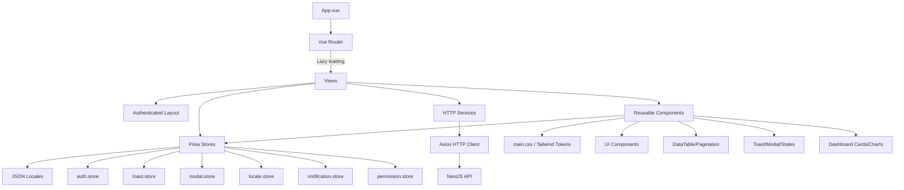

```mermaid
flowchart TB
    APP[App.vue]
    ROUTER[Vue Router]
    LAYOUT[Authenticated Layout]
    VIEWS[Views]
    COMPONENTS[Reusable Components]
    STORES[Pinia Stores]
    SERVICES[HTTP Services]
    HTTP[Axios HTTP Client]
    API[NestJS API]
    LOCALES[JSON Locales]
    STYLES[main.css / Tailwind Tokens]

    APP --> ROUTER
    ROUTER -->|Lazy loading| VIEWS
    VIEWS --> LAYOUT
    VIEWS --> COMPONENTS
    VIEWS --> STORES
    VIEWS --> SERVICES

    COMPONENTS --> STYLES
    COMPONENTS --> STORES

    STORES --> LOCALES
    SERVICES --> HTTP
    HTTP --> API

    STORES --> AUTH[auth.store]
    STORES --> TOAST[toast.store]
    STORES --> MODAL[modal.store]
    STORES --> LOCALE[locale.store]
    STORES --> NOTIFICATION[notification.store]
    STORES --> PERMISSION[permission.store]

    COMPONENTS --> UI[UI Components]
    COMPONENTS --> TABLES[DataTable/Pagination]
    COMPONENTS --> FEEDBACK[Toast/Modal/States]
    COMPONENTS --> DASHBOARD[Dashboard Cards/Charts]
```